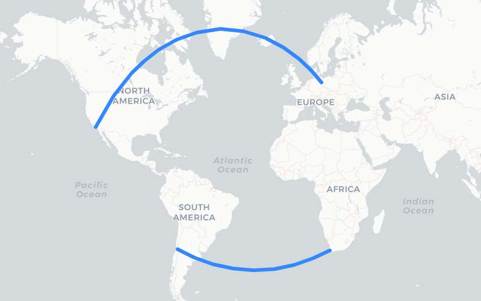

# Leaflet.Geodesic
[](https://travis-ci.org/henrythasler/Leaflet.Geodesic) [](https://www.npmjs.com/package/leaflet.geodesic) [](https://coveralls.io/github/henrythasler/Leaflet.Geodesic?branch=master) [](https://sonarcloud.io/dashboard?id=henrythasler_Leaflet.Geodesic) [](https://lgtm.com/projects/g/henrythasler/Leaflet.Geodesic/alerts/) [](https://lgtm.com/projects/g/henrythasler/Leaflet.Geodesic/context:javascript)

Add-on for [Leaflet](http://leafletjs.com/) to draw [geodesic](http://en.wikipedia.org/wiki/Geodesics_on_an_ellipsoid) lines and great circles. A geodesic line is the shortest path between two given positions on the earth surface.

[Live Demos and Tutorials](https://blog.cyclemap.link/Leaflet.Geodesic/)

---
> ## 🔴 Attention 🔴
> This plug-in and this readme is in the progress of [being updated](https://github.com/henrythasler/Leaflet.Geodesic/issues/40).
>
> Until this is finished, please refer to the [Javascript-Branch](https://github.com/henrythasler/Leaflet.Geodesic/tree/javascript) for the current version.
---

## Add the plugin to your project

Leaflet.Geodesic is available via CDN. Add the following snippet to your html-file after you have [included leaflet.js](https://leafletjs.com/examples/quick-start/).

```html
<!-- Make sure you put this AFTER leaflet.js -->
<script src="https://cdn.jsdelivr.net/npm/leaflet.geodesic/dist/leaflet.geodesic.umd.min.js"></script>
```

Leaflet.Geodesic is available from [unpkg](https://unpkg.com/browse/leaflet.geodesic) and [jsDelivr](https://www.jsdelivr.com/package/npm/leaflet.geodesic).

## Basic usage

- `L.Geodesic` calculates the geodesic lines between all points of a given line- or multiline-string. 
- `L.GreatCircle` calculates a circle with a specific radius around a given point.

The Objects can be created as follows:

```JavaScript
const geodesicLine = new L.Geodesic().addTo(map);   // creates a blank geodesic-line-object and adds it to the map
const greatCircle = new L.GreatCircle().addTo(map);   // creates a blank great-circle-object and adds it to the map
```

Make sure you add the geodesic-object to the map. It won't display otherwise.

Each constructor is defined as:
```JavaScript
constructor(latlngs?: L.LatLngExpression[] | L.LatLngExpression[][], options?: GeodesicOptions)
```

## Geometry

The geometry (points) to use can be given during creation as:

### Objects (Literals)

```JavaScript
const Berlin = {lat: 52.5, lng: 13.35};
const LosAngeles = {lat: 33.82, lng: -118.38};
const geodesic = new L.Geodesic([Berlin, LosAngeles]).addTo(map);
```

### LatLng-Class

```JavaScript
const Berlin = new L.LatLng(52.5, 13.35);
const LosAngeles = new L.LatLng(33.82, -118.38);
const geodesic = new L.Geodesic([Berlin, LosAngeles]).addTo(map);
``` 

### Tuples

```JavaScript
const Berlin = [52.5, 13.35];
const LosAngeles = [33.82, -118.38];
const geodesic = new L.Geodesic([Berlin, LosAngeles]).addTo(map);
```


### Line-strings

Multiple consecutive points can be given as an array (linestring):

```JavaScript
const places = [
    new L.LatLng(52.5, 13.35), // Berlin
    new L.LatLng(33.82, -118.38), // Los Angeles
    new L.LatLng(-33.44, -70.71), // Santiago
    new L.LatLng(-33.94, 18.39), // Capetown
];
const geodesic = new L.Geodesic(places).addTo(map);
```


### Multi-line-strings

Multiple independent linestrings can be defined as a 2-dimensional array:

```JavaScript
const places = [
    [   // 1st line
        new L.LatLng(52.5, 13.35), // Berlin
        new L.LatLng(33.82, -118.38), // Los Angeles
    ],
    [   // 2nd line
        new L.LatLng(-33.44, -70.71), // Santiago
        new L.LatLng(-33.94, 18.39), // Capetown
    ]
];
const geodesic = new L.Geodesic(places).addTo(map);
```



### Updating the geometry

Each Geodesic-Class provides a `setLatLngs()`-Method, that can be used to update the geometry of an existing geodesic-object:

```Javascript
const geodesic = new L.Geodesic().addTo(map);   // add empty object to the map

const Berlin = new L.LatLng(52.5, 13.35);
const LosAngeles = new L.LatLng(33.82, -118.38);
geodesic.setLatLngs([Berlin, LosAngeles])   // update in-place
```

The `setLatLngs()`-Method accepts the same types (Literal, Tuple, LatLang-Class, Linstring, Multilinestring) as the L.Geodesic-constructor itself.

## 🚧 Creat Circles 

(coming soon)

## Options
All options defined for [Polyline](http://leafletjs.com/reference.html#polyline) and [Path](https://leafletjs.com/reference.html#path) for can be used Leaflet.Geodesic.

The most important are:

Option  | Type | Default | Description
---|---|---|---
color |	String | "#3388ff" | Stroke color
weight | Number | 3 | Stroke width in pixels (on your screen)
opacity | Number | 1.0 | Stroke opacity (0=transparent, 1=opaque)

Example:

```Javascript
const Berlin = new L.LatLng(52.5, 13.35);
const LosAngeles = new L.LatLng(33.82, -118.38);
const options = {
    weight: 10,
    opacity: 0.5,
    color: 'red',
};
const geodesic = new L.Geodesic([Berlin, LosAngeles], options).addTo(map);
```


## 🚧 GeoJSON Support

(coming soon)
